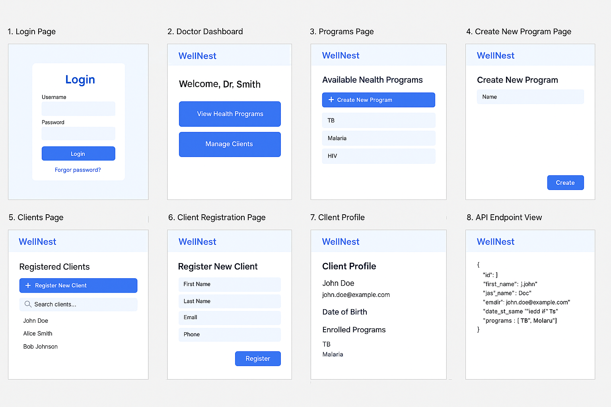

# **WellNest Health Management System**

## Overview

**WellNest** is a health management system designed to streamline the process of creating health programs, managing client registrations, and tracking client progress. Developed using Django and built with an **API-first** approach, the system enables doctors to create and manage health programs, enroll clients, and access client profiles while ensuring data security and scalability.

This repository contains the backend implementation of the WellNest system. It follows clean coding practices, security best practices, and is designed to be extensible for future enhancements.

## Features

- **Health Program Management**: Doctors can create personalized health programs and enroll clients.
- **Client Registration**: Clients can be registered in the system, with all necessary personal information captured for future tracking.
- **Client Profile Access**: Doctors can view client profiles, track enrolled programs, and monitor client progress.
- **API Integration**: The system exposes client profiles and data through an API, ensuring easy integration with other systems.
- **Security**: Data protection measures are implemented to ensure sensitive health information remains secure.
- **Admin and Doctor Dashboards**: The system includes both a superuser admin interface for administrative tasks and an HTML dashboard interface for doctors.

## Technology Stack

- **Backend**: Django (Python)
- **Database**: SQLite (default for development; can be switched to PostgreSQL in production)
- **API**: Django REST Framework (DRF)
- **Authentication**: Django's built-in authentication system
- **Security**: Best practices for secure data handling (e.g., HTTPS, data encryption)

## Prototype



## Getting Started

### Prerequisites

Ensure you have the following software installed on your machine:

- Python 3.x
- Django
- SQLite (or PostgreSQL for production)
- pip (Python package manager)

### Installation

1. **Clone the repository**:
   ```bash
   git clone (https://github.com/Leeshirn/CEMA-Software-Engineering.git)
   cd health_system
   ```
2. Install the dependencies
```bash
pip install django djangorestframework-simplejwt djangorestframework
```
## Usage
Admin Interface: To access the Django admin interface, go to /admin/ after logging in with the superuser credentials.

Doctor Dashboard: Doctors can access their HTML dashboard via the URL /dashboard/.

Client API: The API exposes client data through endpoints such as /api/clients/ and /api/programs/.

## API Documentation
Endpoints include:

GET /api/clients/: Retrieve a list of clients.

POST /api/clients/: Register a new client.

GET /api/clients/{id}/: Retrieve a client's profile.

POST /api/programs/: Create a new health program.

GET /api/programs/: Retrieve a list of health programs.

## Code Structure
health_system/: Main project directory containing core Django settings.

health/: Contains models, views, and serializers for managing health programs and client data.

health_system/urls.py: URL routing configuration.

manage.py: Django management script for running the server and managing the project.

## Contributing
We welcome contributions to improve the WellNest Health Management System. To contribute:

1. Fork the repository.
2. Create a new branch for your changes.
3. Make your changes and test them.
4. Submit a pull request with a description of your changes.

